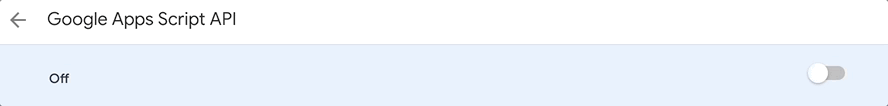
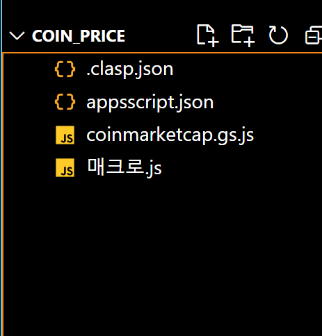

# apps script in vscode

# vscode에서 구글 앱스스크립트 사용하기 [유튜브](https://www.youtube.com/watch?v=lwxiEB-Mnys)  

# 기본 설정  
- vscode 설치  
- node 설치  

# clasp을 이용해서 vscode에서 apps script 사용하기. [github](https://github.com/google/clasp)  

- clasp 설치하기  
  
  &darr; `/` &darr; `bash shell`
  ```bash  
  npm install -g @google/clasp
  ```

<br>  

- Then enable the Google Apps Script API: https://script.google.com/home/usersettings  
 
    

<br>

- google 연동하기  
  
  &darr; `/` &darr; `bash shell`
  ```bash  
  clasp login
  ```

<br>  

- AppsScript저장할 폴더 생성하기    
  
  &darr; `/` &darr; `bash shell`
  ```bash  
  mkdir src
  ```

<br>  

- AppsScript불러오기  
  - clasp clone "AppsScript-Project-Id" --rootDir [폴더명]
  - --rootDir [폴더명] : 폴더명의 폴더가없으면 에러뜸, 폴더명에 코드 넣어짐(옵션)  
  - `--rootDir` 옵션 넣을필요없음, 오히려 불편함.. 코드가, 폴더로 들어가고 업로드를 하려면 다시 옴겨야함.

    &darr; `/` &darr; `bash shell`
    ```bash
    clasp clone "1KWVXjyD1XEifIYQYTLdJs40w-ATBt09QF8bRlmRz9fi_662h6-ZuS6Mz"
    ```

<br>

- `appsscript.json` 파일 기본 경로로 옴기기.  
  - clasp 명령어를 기본경로에서 실행하기 위한 경로이동.  
  - 아래 그림과 같이 폴더에 안들어가 있으면 이 코드는 필요없음.  코드 수정후 푸시하면됨  

      
  
    &darr; `/` &darr; `bash shell`
    ```bash
    mv src/.clasp.json .clasp.json
    ```  

<br>

- clasp push [-w]  
  - 구글로 업로드  
  - -w 옵션 실행시 변경사항 있을땜다 자동으로 푸쉬함.(종료는 ctrl+c)  
  
    &darr; `/` &darr; `bash shell`
    ```bash
    clasp push
    ```

- clasp pull
  - 구글에서 불러오기  

    &darr; `/` &darr; `bash shell`
    ```bash
    clasp pull
    ```

<br>  

---  

# Google Apps Script 자동환성 VSCODE에서 적용하기 [문서](https://github.com/google/clasp/blob/master/docs/typescript.md)  

- npm으로 설치하기  
  
  &darr; `/` &darr; `bash shell`
  ```bash
  npm i -S @types/google-apps-script
  ```